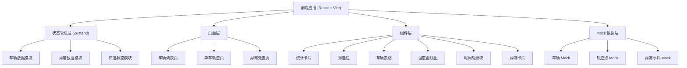
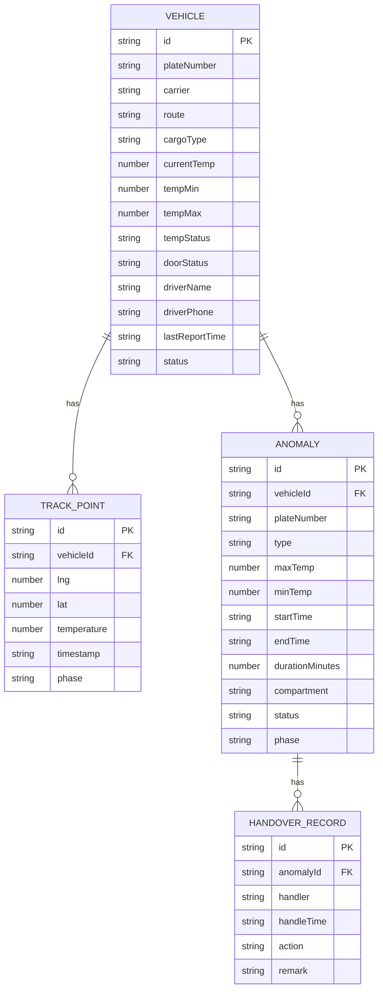

## 1. 架构设计



## 2. 技术描述

- **前端框架**：React@18 + TypeScript
- **构建工具**：Vite@5
- **样式方案**：TailwindCSS@3
- **状态管理**：Zustand
- **路由管理**：React Router DOM@6
- **图表库**：Recharts（温度曲线、统计图表）
- **图标库**：Lucide React
- **地图方案**：自定义 SVG 模拟地图轨迹（无外部地图服务依赖）
- **后端**：无，纯前端 Mock 数据
- **数据库**：无，内存 Mock 数据

## 3. 路由定义

| 路由 | 页面 | 说明 |
|------|------|------|
| /vehicles | 车辆列表页 | 在途车辆筛选与列表展示 |
| /vehicles/:id | 单车轨迹页 | 地图轨迹与温度时间轴回放 |
| /anomalies | 异常处置页 | 异常列表与处理记录 |
| / | 重定向 | 重定向到 /vehicles |

## 4. 数据模型

### 4.1 数据模型定义



### 4.2 核心类型定义

```typescript
// 温度状态枚举
type TempStatus = 'normal' | 'warning' | 'alert';

// 门磁状态
type DoorStatus = 'closed' | 'open';

// 运输阶段
type TransportPhase = 'loading' | 'waiting' | 'transporting' | 'unloading';

// 异常状态
type AnomalyStatus = 'pending' | 'processing' | 'reviewing' | 'resolved';

// 处理动作
type HandleAction = 'notify_driver' | 'contact_customer' | 'send_review' | 'mark_resolved';

// 车辆信息
interface Vehicle {
  id: string;
  plateNumber: string;
  carrier: string;
  route: string;
  cargoType: string;
  currentTemp: number;
  tempMin: number;
  tempMax: number;
  tempStatus: TempStatus;
  doorStatus: DoorStatus;
  driverName: string;
  driverPhone: string;
  lastReportTime: string;
  status: 'in_transit' | 'parked';
}

// 轨迹点
interface TrackPoint {
  id: string;
  vehicleId: string;
  lng: number;
  lat: number;
  temperature: number;
  timestamp: string;
  phase: TransportPhase;
}

// 异常事件
interface Anomaly {
  id: string;
  vehicleId: string;
  plateNumber: string;
  type: 'over_high' | 'over_low';
  maxTemp: number;
  minTemp: number;
  startTime: string;
  endTime: string | null;
  durationMinutes: number;
  compartment: string;
  status: AnomalyStatus;
  phase: TransportPhase;
}

// 交接记录
interface HandoverRecord {
  id: string;
  anomalyId: string;
  handler: string;
  handleTime: string;
  action: HandleAction;
  remark: string;
}
```

## 5. 项目结构

```
src/
├── components/          # 可复用组件
│   ├── Layout/         # 布局组件（侧边栏、顶栏）
│   ├── VehicleTable/   # 车辆表格
│   ├── FilterBar/      # 筛选栏
│   ├── StatCard/       # 统计卡片
│   ├── TempChart/      # 温度曲线图
│   ├── TimeSlider/     # 时间轴滑块
│   ├── TrackMap/       # 轨迹地图
│   ├── AnomalyCard/    # 异常卡片
│   └── StatusBadge/    # 状态标签
├── pages/              # 页面组件
│   ├── VehicleList/    # 车辆列表页
│   ├── VehicleDetail/  # 单车轨迹页
│   └── AnomalyList/    # 异常处置页
├── store/              # Zustand 状态管理
│   ├── vehicleStore.ts
│   ├── anomalyStore.ts
│   └── filterStore.ts
├── mock/               # Mock 数据
│   ├── vehicles.ts
│   ├── trackPoints.ts
│   └── anomalies.ts
├── types/              # TypeScript 类型定义
│   └── index.ts
├── utils/              # 工具函数
│   ├── format.ts
│   └── temperature.ts
├── App.tsx
├── main.tsx
└── index.css
```

## 6. 关键设计决策

1. **地图实现**：使用 SVG 自定义绘制简化地图与轨迹，避免引入重量级地图库，保证加载速度与离线可用性
2. **数据刷新**：使用定时器模拟实时数据更新，每 30 秒刷新一次车辆状态
3. **时间轴交互**：自定义 range 滑块组件，支持阶段分段标记与超温段高亮
4. **温度色阶**：根据温度值在温区内的位置计算颜色，实现温度到颜色的视觉映射
5. **状态持久化**：异常处理记录暂存于 store 中，刷新页面重置（Mock 环境）
